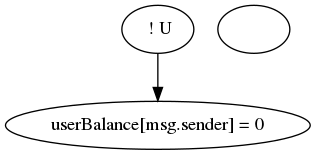
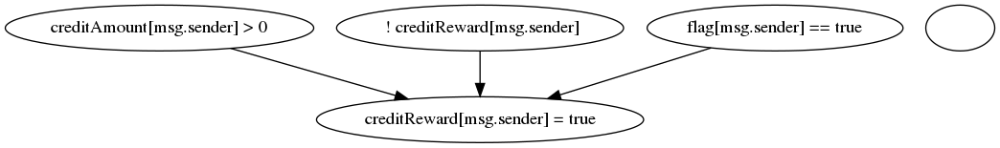

<h1 align="center">SailfishDocumentation</h1>

Все графы будут сгенерированы для следубщего котракта и функции withdrawBalance (если не приведён какой-то другой пример):

pragma solidity ^0.4.24;

contract Reentrancy {
    mapping (address => uint) userBalance;
   
    function getBalance(address u) view public returns(uint){
        return userBalance[u];
    }

    function addToBalance() payable public{
        userBalance[msg.sender] += msg.value;
    }   

    function withdrawBalance() public{
        // send userBalance[msg.sender] ethers to msg.sender
        // if mgs.sender is a contract, it will call its fallback function
        if( ! (msg.sender.call.value(userBalance[msg.sender])() ) ){
            revert();
        }
        userBalance[msg.sender] = 0;
    }   
}

## Начало

Идёт инициализация Slither. Из него берут информацию о функциях и переменных для построения зависимостей.

slither_obj = Slither(contract_path, solc=solc_path)

## Callgraph

Для каждой функции из каждого контракта добавляется вершина для функции в граф. В конце все вершины складываются в общий граф. Рёбер на этом этапе нет, функции на отдельные иструкции не раскладываются. 

(Замечание: есть ещё проверки на interanl и external call для функций, которые так же влияют на граф, но в моём примере эти проверки не прошли)

## generate_icfg

Для начала генерируется граф cfg для каждой функции. На этом этапе функция разбивается на блоки с интсрукциями. 

Далее cfg используется для icfg. В данном примере разницы между ними нет.

Однако, если внурти одной функции есть вызов другой функции контракта (неважно, публичной или приватной), этот вызов разоюбъётся на отдельные блоки. Это можно видеть в данном примере:

pragma solidity ^0.4.21;
contract Foo {
    mapping (address => uint256) public balance;
    mapping (address => uint256) public randomValues;

    
    function functionWithPublicFunction(uint256 value) public payable {
       balance[msg.sender] += msg.value;
       publicFunction(value, msg.sender);
    }

    function functionWithPrivateFunction(uint256 value) public payable {
       balance[msg.sender] += msg.value;
       privateFunction(value, msg.sender);
    }

    function publicFunction(uint256 value, address to) public {
        privateFunction(value, msg.sender);
        randomValues[to] *= value;
    }

    function privateFunction(uint256 value, address to) private {
        randomValues[to] += value;
    }
}

Будут сгенерированы такие cfg и icfg:

## range_graph
Для каждой функии находятся зависимости глобальных переменных. На данном примере условие является вызовом некоторой функции и обозначается как U.

При рассмотрении функции ниже есть 3 условия выполнения блока if и в нём есть 3 изменения глобальных переменных. Для каждого из этого изменения сгенерируется свой range граф:

function withdrawAllBalance() public {
    uint creditBalance = creditAmount[msg.sender];
    
    if (creditBalance > 0 && !creditReward[msg.sender] && flag[msg.sender])
    {
      flag[msg.sender] = false;
      creditReward[msg.sender] = true;
      msg.sender.call.value(creditBalance)("");
      creditAmount[msg.sender] = 0;
    }
  }

